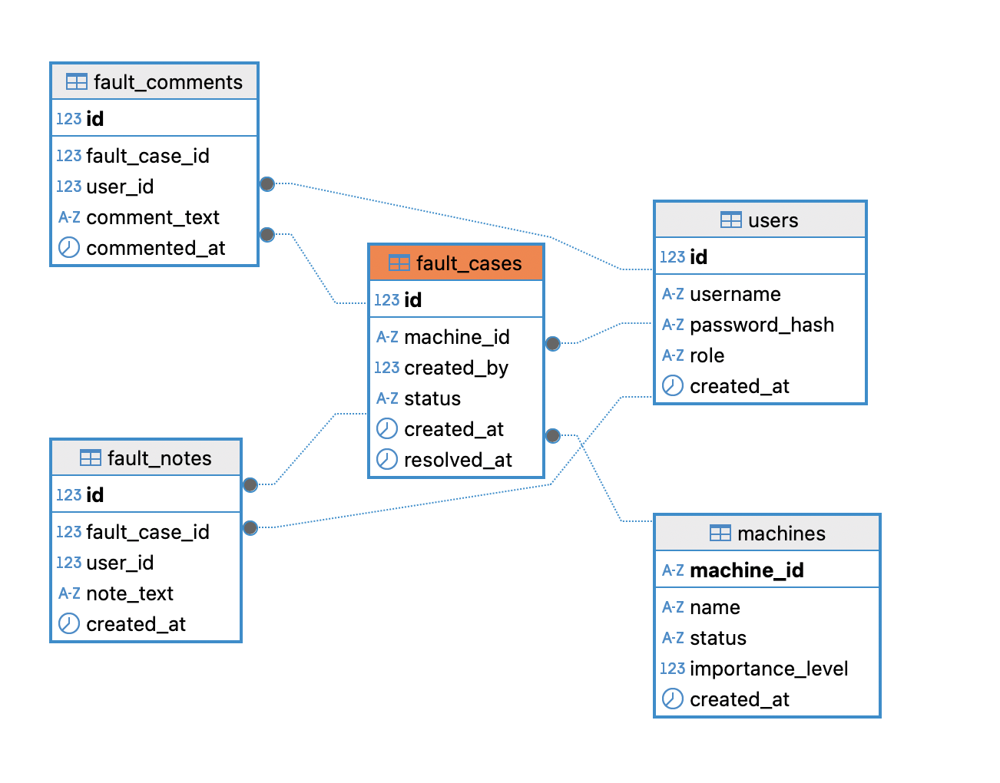

# Database

> Database Version
> 

Database: MySQL 8.0

> Create database:
> 

```sql
CREATE DATABASE factory
CHARACTER SET utf8mb4
COLLATE utf8mb4_unicode_ci;
```

> Tables
> 

| Table Name | Purpose (Description) |
| --- | --- |
| users | Stores user accounts, roles, and registration information for access control. |
| machines | Stores information about factory machines and their operational status. |
| warnings | Stores warning messages related to specific machines. |
| fault_cases | Records fault cases when a machine breaks down and tracks their resolution status. |
| fault_notes | Contains detailed notes and progress updates related to fault cases. |
| fault_note_images | Stores images linked to fault notes, such as damage photos or inspection screenshots. |
| fault_comments | Stores user comments on fault cases for communication and quick updates. |
| machine_assignments | Tracks which users are assigned to which machines and in what roles. |

This is the main ER diagram：



If you’re using DBeaver, I recommend creating the tables one by one. When you run the entire SQL script in DBeaver, MySQL treats it as a batch statement, but by default, it doesn’t “commit” or “execute” each statement immediately. As a result, you might encounter errors like “Failed to open the referenced table.”

```sql
-- =========================================
-- DROP tables in reverse dependency order
-- =========================================
DROP TABLE IF EXISTS fault_note_images;
DROP TABLE IF EXISTS fault_comments;
DROP TABLE IF EXISTS fault_notes;
DROP TABLE IF EXISTS fault_cases;
DROP TABLE IF EXISTS warnings;
DROP TABLE IF EXISTS machine_assignments;
DROP TABLE IF EXISTS machines;
DROP TABLE IF EXISTS users;

-- =========================================
-- Table: users
-- Purpose: Stores user information and role definitions for access control.
-- =========================================
CREATE TABLE users (
    id INT PRIMARY KEY AUTO_INCREMENT, -- Unique user ID
    username VARCHAR(50) UNIQUE NOT NULL, -- Login username
    password_hash VARCHAR(255) NOT NULL, -- Hashed password
    role ENUM('Technician', 'Repair', 'Manager', 'ViewOnly') NOT NULL, -- Role of the user
    created_at DATETIME DEFAULT CURRENT_TIMESTAMP -- Registration timestamp
);

-- =========================================
-- Table: machines
-- Purpose: Stores information about all factory machines and their current operational status.
-- =========================================
CREATE TABLE machines (
    machine_id CHAR(12) PRIMARY KEY, -- A fixed-length 12-character ID of letters and digits
    name VARCHAR(100), -- Machine name
    status ENUM('OK', 'Warning', 'Fault') DEFAULT 'OK', -- Current machine status
    importance_level INT DEFAULT 1 CHECK (importance_level BETWEEN 1 AND 5), -- Importance level
    created_at DATETIME DEFAULT CURRENT_TIMESTAMP -- Creation timestamp
);

-- =========================================
-- Table: warnings
-- Purpose: Stores warning messages associated with specific machines.
-- =========================================
CREATE TABLE warnings (
    id INT PRIMARY KEY AUTO_INCREMENT, -- Unique warning ID
    machine_id CHAR(12) NOT NULL, -- Related machine
    warning_text TEXT NOT NULL, -- Warning description
    created_by INT NOT NULL, -- User who added the warning
    created_at DATETIME DEFAULT CURRENT_TIMESTAMP, -- Timestamp
    FOREIGN KEY (machine_id) REFERENCES machines(machine_id),
    FOREIGN KEY (created_by) REFERENCES users(id)
);

-- =========================================
-- Table: fault_cases
-- Purpose: Represents individual fault cases raised when a machine breaks down.
-- =========================================
CREATE TABLE fault_cases (
    id INT PRIMARY KEY AUTO_INCREMENT, -- Unique fault case ID
    machine_id CHAR(12) NOT NULL, -- Faulty machine
    created_by INT NOT NULL, -- Who created the case
    status ENUM('Open', 'Resolved') DEFAULT 'Open', -- Case status
    created_at DATETIME DEFAULT CURRENT_TIMESTAMP, -- When it was created
    resolved_at DATETIME, -- When it was resolved (nullable)
    FOREIGN KEY (machine_id) REFERENCES machines(machine_id),
    FOREIGN KEY (created_by) REFERENCES users(id)
);

-- =========================================
-- Table: fault_notes
-- Purpose: Stores detailed notes, progress updates, or explanations for fault cases.
-- =========================================
CREATE TABLE fault_notes (
    id INT PRIMARY KEY AUTO_INCREMENT, -- Unique note ID
    fault_case_id INT NOT NULL, -- Related fault case
    user_id INT NOT NULL, -- Who made the note
    note_text TEXT NOT NULL, -- The note content
    created_at DATETIME DEFAULT CURRENT_TIMESTAMP, -- When it was written
    FOREIGN KEY (fault_case_id) REFERENCES fault_cases(id),
    FOREIGN KEY (user_id) REFERENCES users(id)
);

-- =========================================
-- Table: fault_note_images
-- Purpose: Stores images linked to specific fault notes.
-- =========================================
CREATE TABLE fault_note_images (
    id INT PRIMARY KEY AUTO_INCREMENT, -- Unique image ID
    fault_note_id INT NOT NULL, -- Which note this image belongs to
    image_data LONGBLOB NOT NULL, -- The binary image data
    filename VARCHAR(100), -- Original filename
    uploaded_at DATETIME DEFAULT CURRENT_TIMESTAMP, -- Upload time
    FOREIGN KEY (fault_note_id) REFERENCES fault_notes(id)
);

-- =========================================
-- Table: fault_comments
-- Purpose: Stores user comments on fault cases for discussions or quick updates.
-- =========================================
CREATE TABLE fault_comments (
    id INT PRIMARY KEY AUTO_INCREMENT, -- Unique comment ID
    fault_case_id INT NOT NULL, -- Which fault case the comment belongs to
    user_id INT NOT NULL, -- Who made the comment
    comment_text TEXT NOT NULL, -- The comment
    commented_at DATETIME DEFAULT CURRENT_TIMESTAMP, -- Time of commenting
    FOREIGN KEY (fault_case_id) REFERENCES fault_cases(id),
    FOREIGN KEY (user_id) REFERENCES users(id)
);

-- =========================================
-- Table: machine_assignments
-- Purpose: Stores which users are assigned to which machines and in what role.
-- =========================================
CREATE TABLE machine_assignments (
    id INT PRIMARY KEY AUTO_INCREMENT, -- Unique assignment ID
    machine_id CHAR(12) NOT NULL, -- Related machine
    user_id INT NOT NULL, -- Assigned user
    assigned_role ENUM('Technician', 'Repair') NOT NULL, -- Role on this machine
    assigned_by INT NOT NULL, -- Who made the assignment
    assigned_at DATETIME DEFAULT CURRENT_TIMESTAMP, -- Assignment time
    FOREIGN KEY (machine_id) REFERENCES machines(machine_id),
    FOREIGN KEY (user_id) REFERENCES users(id),
    FOREIGN KEY (assigned_by) REFERENCES users(id)
);
```

**Note：**

Please inform me if you add or delete any fields during development. This is very important to ensure the correct database structure is created during final setup, and to make sure everything runs smoothly. Thank you! 😄